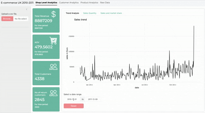

# Shiny E-commerce Dashboard

<!--  -->
<!--  -->
<!--  -->

## Overview
This project contains an interactive **[Shiny](https://github.com/rstudio/shiny)** app that allows users to explore sales trends over time,
dig into customer data and find best-selling products for a **UK-based eCommerce store**.
It provides insights into key **business metrics** by leveraging data visualization 
and filtering capabilities.

The app was developed following **software engineering best practices**,
such as organizing code in a R package structure and using CICD. This simplifies development by
standardising code structure and providing tooling around dependency management,
automatic testing and generation of documentation ensuring maintainability, scalability, and ease of use.

Access the live demo here: **[Live Demo](https://larsabeling.shinyapps.io/ecomdash)**

Or read the documentation here: **[Documentation](https://larsabeling.github.io/ecomdash)**



## Features
- **Interactive Data Filtering**: Filter sales data by date range, customer, and country.
- **Trend Analysis**: Visualize sales performance over time and identify seasonal trends.
- **Customer Insights**: Explore repeat customers, order frequency, and segmentation.
- **Product Performance Tracking**: Identify best-selling and underperforming products.
- **Dynamic Visualizations**: Use **ggplot2**, **plotly**, and **shiny** to generate interactive charts.

## Technology Stack
- **Shiny (R)** – Web application framework
- **ggplot2, plotly** – Data visualization
- **data.table** – Data manipulation
- **bslib** – UI framework 
- **testthat, roxygen2** – Testing and documentation

## Installation & Usage
To run the Shiny app locally, follow these steps:

1. **Clone the repository**:
```sh
git clone https://github.com/abelinglars/ecomdash.git
cd ecomdash
```
2. **Install dependencies** (if not already installed):
```r
renv::restore()
```
3. **Run the app**:
```r
start_app()
```

## Dataset
- The dataset contains historical transaction data from a UK-based online retailer.
- **Key columns**:
  - `invoice_no`: Unique transaction ID
  - `stock_code`: Product identifier
  - `description`: Product name
  - `quantity`: Number of units sold
  - `date`: Date of transaction
  - `unit_price`: Price per unit
  - `customer_id`: Unique customer identifier
  - `country`: Customer’s country
  
- Data has been **cleaned and preprocessed** to improve usability.

## Insights & Use Cases
This dashboard helps:
- Identify top-selling products and seasonal trends
- Understand customer purchasing patterns
- Detect potential market opportunities by analyzing country-wise sales
